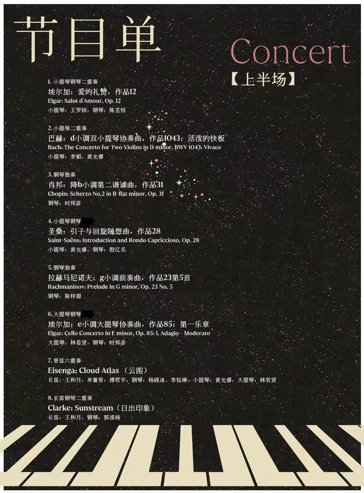
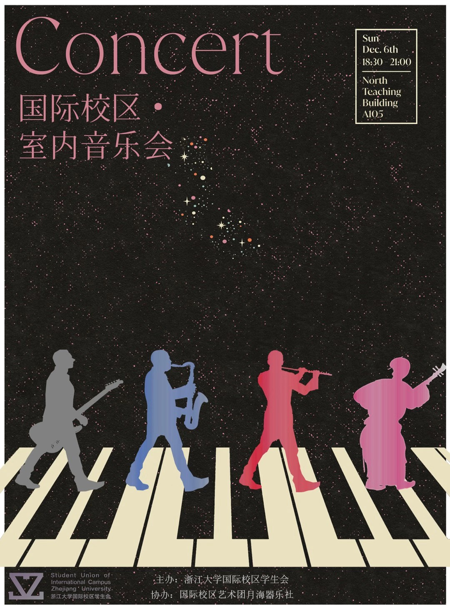
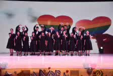
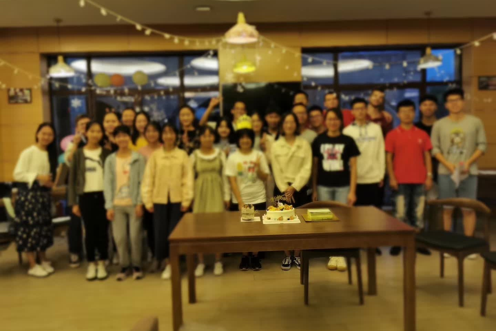

# Home

This is Yulin's personal space to document her journeys in **math**, **science**, and **art**.

> ***Here I am in**: Jan 2025*
>
> 
> Ph.D. Candidate  
> 
> **Department of Statistics, Rutgers--New Brunswick**
> 

## Resources

### [Academics](./docs/academic/index.md)
- **Tutorials**: Learning from sharing.  
  - [A Beginner's Guide to GitHub](./docs/tutorials/HTML_GitHub_Tutorial.html) (v1.5: 01/2025, v1.0: 02/2022)
- **Communities**
  - [**StatsUp AI** (https://statsupai.org)](https://statsupai.org): A frontier information platform for statisticians in AI research and revolution.
  - [**Lunch Salon**](https://mp.weixin.qq.com/s/yIelqWgUyHuEE4iSJwFYGw): A student-organized media for scientific knowledge sharing.
    
    - [ ] `TO-DO: include article links`
    
    > **Bio**:
    > Joint work by 7 of the [ZH1Z](https://en.wikipedia.org/wiki/Zhuhai_No.1_High_School) 2017 graduates.
    >
    > **Articles**: `Psychology`x4, `Biochemistry`x3, `Computer Science & Engineering`x3, `Motorsports Technology`x2, `Linguistics`x2, `Architecture`x1, `Math History`x1, `Music`x1
    >
    > Last update: 02/04/2019
    >

    >  
    >

    >
    
- **[My Reference Library](./reading/index.md)**: Reference organizer and reading roadmap.

- **My Favorites in Statistics**: Domain highlights and key insights.

### Musical Works
`Under construction...`

- Performance Videos  
- Music Scores 
  - Transcriptions
  - Compositions
- Activity Timeline

## My Teaching Journey
### Math & Statistics
#### PhD-level courses
  - **STAT 596: Advanced Applied Statistics I** Fall 2024
      
      Teaching Assistant, Department of Statistics, Rutgers University

  - **MA 751: Statistical Machine Learning** (Section A2, A3) Spring 2023
      
      Teaching Assistant, Department of Math & Statistics, Boston University

      Recitations: 2 hr/wk; Total Class Size: 20

#### Graduate-level courses
  - **MA 575: Linear Models** (Section B1, B2, B3, B4, B5) Spring 2022
      
      Teaching Assistant, Department of Math & Statistics, Boston University
      
      Recitations: 5 hr/wk; Total Class Size: 80
#### Undergraduate-level courses
  - **MATH 241: Calculus III** (Section ?, ?) Fall 2020
      
      Teaching Assistant, ZJU-UIUC Institute, Zhejiang University
      
      Recitations: 4 hr/wk; Total Class Size: 40
  - **MATH 241: Calculus III** (Section ?, ?) Fall 2019
      
      Teaching Assistant, ZJU-UIUC Institute, Zhejiang University
      
      Recitations: 4 hr/wk; Total Class Size: 40
        
### Music

  - **1st Chamber Concert of International Campus, ZJU** Fall 2020
    
    Director, Musical Director, Piano Accompanist

    > 
    > **Event Schedule**: Sunday Dec 6, 2020 `18:30-21:00`
    > 
    > *Event Highlights:* **[*Intl-ZJU News*](https://mp.weixin.qq.com/s/4tOWEFEcM4L6ZsTlfMB37w)**
    > 
    > **Concert Programme**: 
    >

    >  
    >  
    >  
    >

  
  - **Student Choir of International Campus, ZJU** 2017-2020
    
    Musical Director, Conductor, Piano Accompanist
    
    > ***Team members***: ~30 students from all schools, years, ages, and nationalities at the *International Campus of Zhejiang University*.
    > 
    > ***Performed***: 
    > * ***Can't Help Falling in Love*** (A cappella) Dec 2020
    > * ***菊花台*** (SATB) Dec 2019 
    > * ***Seasons of Love*** (SATB) Dec 2019
    >

    >  
    >  
    >

    > 

  - **2019 Freshmen Choral Competition of Zhejiang University** Aug 2019
    
    Music Arranger, Instrument & Vocal Coach
    
    - Team Size: 100+ (representing ZJU-UoE Institute)
    - Total Participants: 4000+
    - Performed: 
      - ***University Anthem***（SATB), arr. Yulin Li (2019)
      - ***汪峰：我爱你中国***（SATB)
    - Placement: ***2nd-Place** Finalist*

  - **2018 Freshmen Choral Competition of Zhejiang University** Aug 2018
    
    Music Arranger, Instrument & Vocal Coach
    
    - Team Size: 80+ (representing ZJU-UoE Institute)
    - Total Participants: 4000+
    - Performed: 
      - ***University Anthem***（SATB), arr. Yulin Li (2018)
      - ***少年中国说***（SATB), arr. Yulin Li (2018)

  - **2017 Freshmen Choral Competition of Zhejiang University** Aug 2017
    
    Music Arranger, Instrument & Vocal Coach, Conductor
    
    - Team Size: 180+ (representing ZJU-UIUC Institute)
    - Total Participants: 4000+
    - Performed: 
      - ***University Anthem***（SATB), arr. Xinhai Zhu (2017)
      - ***生来倔强***（SATB), arr. Yulin Li (2017)
    - Placement: ***2nd-Place** Finalist*

## My Toolboxes

`Under construction...`

### [Projects](./projects/index.md)
- **Ongoing Projects**  

### Toolboxes
- **[Toolbox](./toolbox/index.md)**  

## About This Site

`Under construction...`

*Last updated: 01-12-2025*

