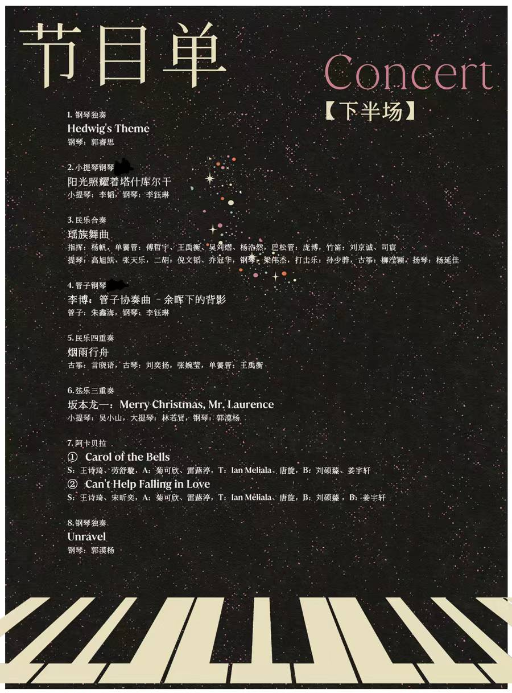

# Home

This is Yulin's personal space to document her journeys in **math**, **science**, and **art**.

> ***Here I am in**: Jan 2025*
> 
>
>Ph.D. Candidate  
>
>**Department of Statistics, Rutgers--New Brunswick**
> 

## Resources

### [Academics](./docs/academic/index.md)
- **Tutorials**: Learning from sharing.  
  - [A Beginner's Guide to GitHub](./docs/tutorials/HTML_GitHub_Tutorial.html) (v1.5: 01/2025, v1.0: 02/2022)
- **Communities**
  - [**StatsUp AI** (https://statsupai.org)](https://statsupai.org): A frontier information platform for statisticians in AI research and revolution.
  - [**Lunch Salon**](https://mp.weixin.qq.com/s/yIelqWgUyHuEE4iSJwFYGw): A student-organized media for scientific knowledge sharing.
  
    ` TO-DO: include article links `

    > **Bio**:
    > Joint work by 7 of the [ZH1Z](https://en.wikipedia.org/wiki/Zhuhai_No.1_High_School) 2017 graduates.
    >
    > **Articles**: `Psychology`x4, `Biochemistry`x3, `Computer Science & Engineering`x3, `Motorsports Technology`x2, `Linguistics`x2, `Architecture`x1, `Math History`x1, `Music`x1
    >
    > Last update: 02/04/2019
    >

    >  
    >

    >
    
- **[My Reference Library](./reading/index.md)**: Reference organizer and reading roadmap.

- **My Favorites in Statistics**: Domain highlights and key insights.

### Musical Works
`Under construction...`

- Performance Videos  
- Music Scores 
  - Transcriptions
  - Compositions
- Activity Timeline

## My Teaching Journey
### Math & Statistics
  - PhD-level courses
    - **STAT 596: Advanced Applied Statistics I** 
        
        Teaching Assistant, Fall 2024
        
        Department of Statistics, Rutgers University

    - **MA 751: Statistical Machine Learning** (Section A2, A3)
        
        Teaching Assistant, Spring 2023

        Department of Math & Statistics, Boston University

        Recitations: 2 hr/wk; Total Class Size: 20

  - Graduate-level courses
    - **MA 575: Linear Models** (Section B1, B2, B3, B4, B5)
        
        Teaching Assistant, Spring 2022

        Department of Math & Statistics, Boston University
        
        Recitations: 5 hr/wk; Total Class Size: 80
  - Undergraduate-level courses
    - **MATH 241: Calculus III** (Section ?, ?)
        
        Teaching Assistant, Fall 2020

        ZJU-UIUC Institute, Zhejiang University
        
        Recitations: 4 hr/wk; Total Class Size: 40
    - **MATH 241: Calculus III** (Section ?, ?)
        
        Teaching Assistant, Fall 2019

        ZJU-UIUC Institute, Zhejiang University
        
        Recitations: 4 hr/wk; Total Class Size: 40
        
### Music
  - **ZJU - International Campus Student Choir** 2017-2020
    
    Director, Conductor, Piano Accompanist
    
    > 
    >

    >  
    >  
    >

    > 

  - **ZJU - International Campus Chamber Concert** Fall 2020
    
    Director, Musical Director, Piano Accompanist

    > 
    > **Event Schedule**: Sunday Dec 6, 2020 `18:30-21:00`
    > 
    > **Concert Programme**: 
    >

    >  
    >  
    >  
    >

    
  - **Zhejiang University Freshmen Choral Competition** Aug 2019
    
    Music Arranger, Instrument & Vocal Coach
    
    Team Size: 100 (representing ZJU-UoE Institute)
    
    **Placement**: 2nd-Place Finalist

  - **Zhejiang University Freshmen Choral Competition** Aug 2018
    
    Music Arranger, Instrument & Vocal Coach
    
    Team Size: 100 (representing ZJU-UoE Institute)

  - **Zhejiang University Freshmen Choral Competition** Aug 2017
    
    Music Arranger, Instrument & Vocal Coach, Conductor
    
    Team Size: 200 (representing ZJU-UIUC Institute)
    
    **Placement**: 2nd-Place Finalist

## My Toolboxes

`Under construction...`

### [Projects](./projects/index.md)
- **Ongoing Projects**  

### Toolboxes
- **[Toolbox](./toolbox/index.md)**  

## About This Site

`Under construction...`

*Last updated: 01-12-2025*

